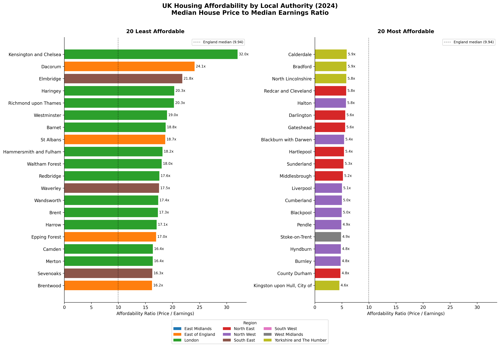
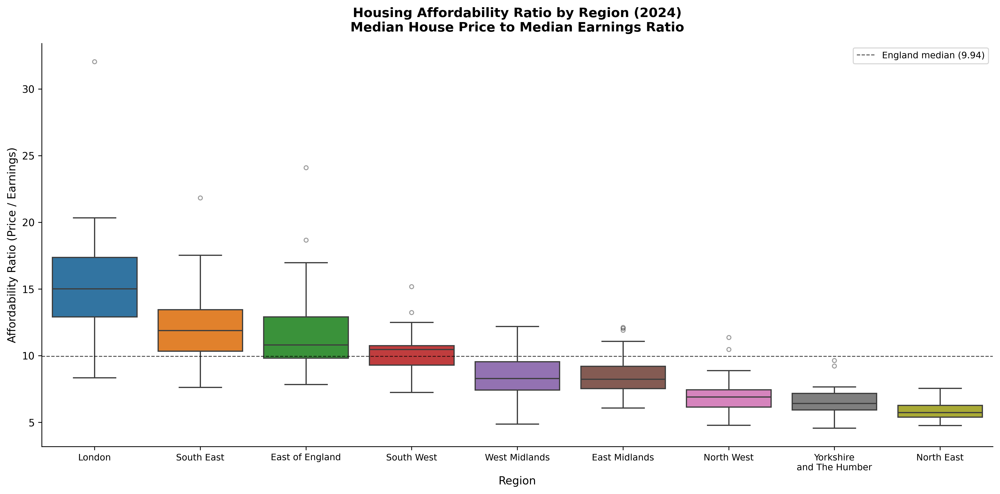
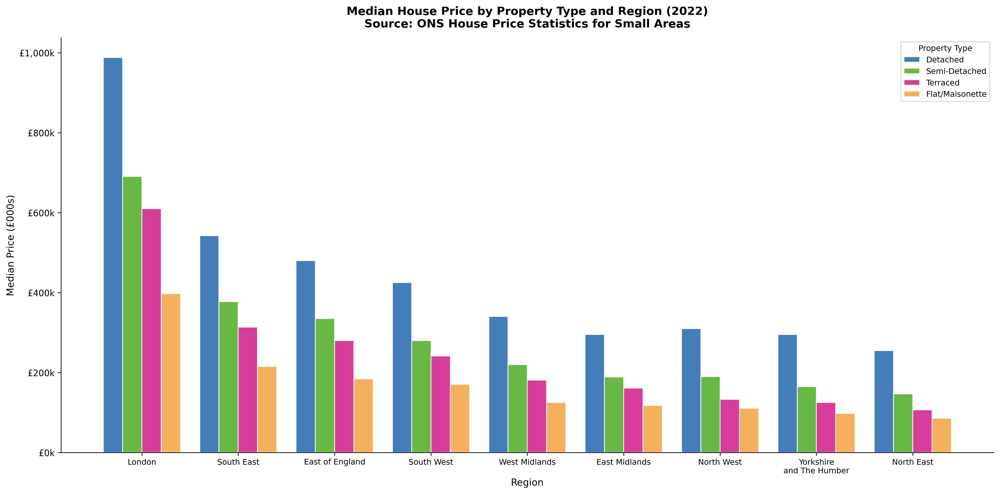
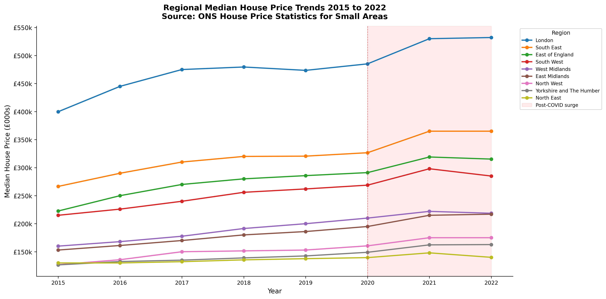
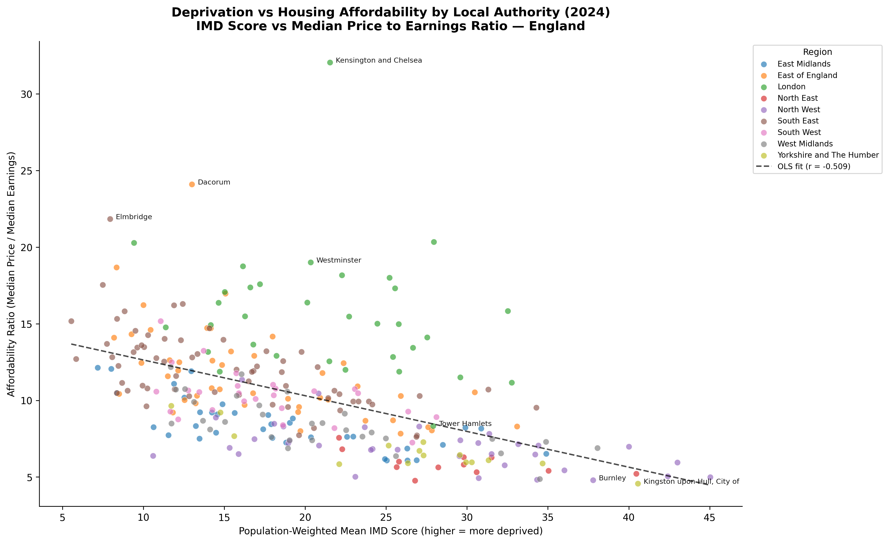

# Project 04 — UK House Price Dynamics

## Overview

A spatial analysis of housing affordability across 296 English local
authorities using 2024 transaction data from HM Land Registry, earnings
data from the ONS Annual Survey of Hours and Earnings, and the IMD 2019
deprivation index. The affordability ratio — median house price divided
by median gross annual earnings — is computed for every English local
authority and analysed by region, property type and deprivation level.

This is Project 04 of a 72-project data science portfolio, the first
project in Era 2 (Modern ML), introducing statsmodels OLS regression
alongside the classical statistical stack.

---

## Key Findings

| Finding                            | Result                                                                                    |
| ---------------------------------- | ----------------------------------------------------------------------------------------- |
| England median affordability ratio | 9.94 — median home costs nearly ten years of median earnings                              |
| Most unaffordable LA               | Kensington and Chelsea: ratio 32.0                                                        |
| Most affordable LA                 | Kingston upon Hull: ratio 4.6                                                             |
| London vs Rest of England          | t = 8.045, Cohen's d = 1.645, p < 0.001                                                   |
| Deprivation vs affordability       | r = -0.509, R2 = 0.260, p < 0.001                                                         |
| OLS regression slope               | -0.233 per IMD point (95% CI: -0.278 to -0.188)                                           |
| Post-COVID surge                   | All regions grew 2020 to 2022; South West and East of England grew fastest proportionally |

---

## Visualisations

### Figure 1 — Affordability Ratio: 20 Least and Most Affordable Local Authorities



### Figure 2 — Regional Affordability Distribution



### Figure 3 — Median Price by Property Type and Region



### Figure 4 — Regional Price Trends 2015 to 2022



### Figure 5 — Deprivation vs Affordability



---

## Datasets

| Dataset                                   | Source           | Coverage                                | Licence |
| ----------------------------------------- | ---------------- | --------------------------------------- | ------- |
| Price Paid Data 2024                      | HM Land Registry | 758,965 transactions, England and Wales | OGL v3  |
| UK House Price Statistics for Small Areas | ONS              | 296 English LAs, 2015 to 2022           | OGL v3  |
| ASHE Table 7.7a Annual Gross Pay 2025     | ONS              | 295 English LAs                         | OGL v3  |
| ONS Postcode Directory February 2026      | ONS Geography    | 2.27M England postcodes                 | OGL v3  |
| Index of Multiple Deprivation 2019        | MHCLG            | 32,844 English LSOAs                    | OGL v3  |

---

## Methodology

Four datasets were merged at local authority level using ONS LAD codes as
the geographic spine. Price Paid Data was loaded in 100,000-row chunks,
filtered to Category A transactions only, and matched to LAD codes via the
ONS Postcode Directory. LA-level median prices were aggregated from 720,215
matched transactions. Affordability ratios were computed as median house
price divided by median gross annual earnings from ASHE. IMD scores were
aggregated from LSOA to LA level using population-weighted means.

Two local authorities — Barnsley and Sheffield — received new LAD codes in
2025 following boundary reorganisations and were manually assigned to their
correct regions. Nine local authorities created by post-2019 boundary
reorganisations had IMD scores reconstructed by aggregating predecessor
LSOA data using population-weighted means.

Statistical analysis used Welch's t-test to compare London and rest-of-England
affordability ratios, Pearson correlation to measure the deprivation-affordability
relationship, and OLS regression via statsmodels to quantify the slope. All
figures were produced at 300 DPI.

---

## Project Structure

```
project4/
├── ds_env/                          ← virtual environment, never committed
├── data/
│   ├── raw/                         ← never committed
│   │   ├── pp-2024.csv              ← Price Paid Data 2024
│   │   ├── hpssa_la.csv             ← ONS House Price Stats for Small Areas
│   │   ├── onspd_subset.csv         ← postcode to LAD lookup (subset)
│   │   └── ashe_la_earnings.csv     ← ASHE LA median earnings
│   └── processed/
│       └── house_prices_final.csv   ← merged, cleaned, analysis-ready
├── notebooks/
│   ├── 01_data_profiling.ipynb
│   ├── 02_analysis.ipynb
│   └── 03_visualisation.ipynb
├── src/
│   └── analysis.py                  ← reusable functions
├── reports/
│   └── policy_brief.md
├── figures/
│   ├── 01_affordability_ratio_map.png
│   ├── 02_regional_affordability.png
│   ├── 03_property_type_prices.png
│   ├── 04_price_surge_regions.png
│   └── 05_deprivation_vs_affordability.png
├── config.py
├── requirements.txt
├── .gitignore
└── README.md
```

---

## How to Reproduce

```bash
# Clone the repository
git clone https://github.com/insightful-algorithms/project04-uk-house-price-dynamics
cd project04-uk-house-price-dynamics

# Create virtual environment
"C:\Users\TEST\AppData\Local\Programs\Python\Python313\python.exe" -m venv ds_env
ds_env\Scripts\activate

# Install dependencies
pip install -r requirements.txt

# Register Jupyter kernel
python -m ipykernel install --user --name=project4-env --display-name="P04 House Prices"

# Launch Jupyter
jupyter notebook
```

Download the raw datasets listed above and place them in `data/raw/` before
running the notebooks. Run notebooks in order: 01, 02, 03.

---

## Technologies Used

| Technology  | Version | Purpose                   |
| ----------- | ------- | ------------------------- |
| Python      | 3.13.2  | Core language             |
| Pandas      | 3.0.2   | Data manipulation         |
| NumPy       | 2.4.4   | Numerical computation     |
| Statsmodels | 0.14.6  | OLS regression            |
| Scipy       | latest  | Pearson r, Welch's t-test |
| Matplotlib  | 3.10.8  | Figure production         |
| Seaborn     | 0.13.2  | Statistical visualisation |
| Openpyxl    | latest  | Excel file loading        |
| Jupyter     | latest  | Notebook environment      |

---

## Portfolio Context

| Phase | Era | Project | Title                                | Status       |
| ----- | --- | ------- | ------------------------------------ | ------------ |
| 1     | 1   | P01     | UK Road Safety Analysis              | Complete     |
| 1     | 1   | P02     | NHS Regional Health Outcomes         | Complete     |
| 1     | 1   | P03     | UK Crime and Deprivation             | Complete     |
| 1     | 2   | **P04** | **UK House Price Dynamics**          | **Complete** |
| 1     | 2   | P05     | European Climate Trends              | Planned      |
| 1     | 2   | P06     | UK Labour Market and Wage Inequality | Planned      |

---
## Author

**Ose Omokhua**
MSc Data Science · BSc Physics 
London, UK

Open to Data Engineer & Data Scientist roles (UK and Remote)

[](https://github.com/insightful-algorithms)
[](https://linkedin.com/in/omokhua-ose)
---

